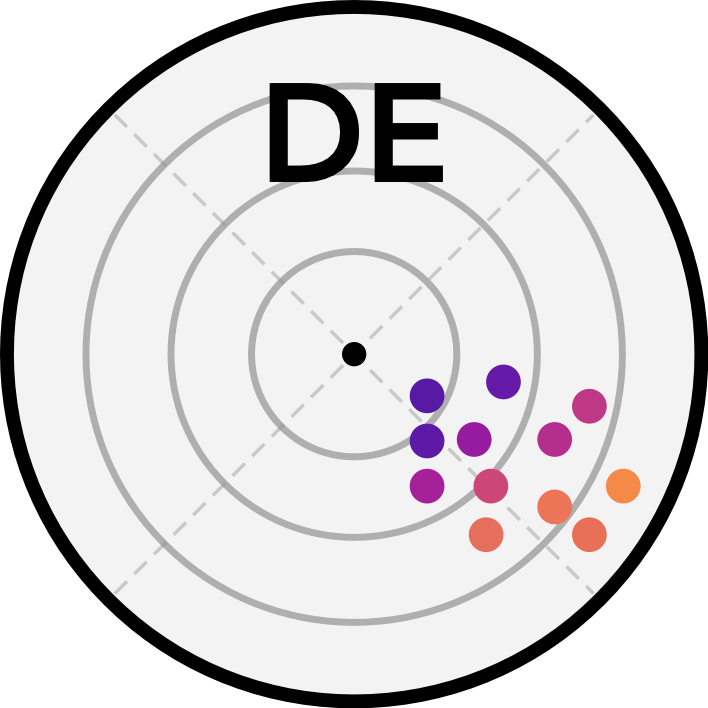

# diag-eff 

Info: `diag-eff` needs Python >= 3.6!

[](https://travis-ci.com/schwemro/diag-eff)
[](https://diag-eff.readthedocs.io/en/latest/?badge=latest)
[](https://codecov.io/gh/schwemro/de)
[](https://pypi.python.org/pypi/diag-eff/)
[](http://perso.crans.org/besson/LICENSE.html)
[](http://mybinder.org/v2/gh/binder-examples/conda_environment/master?filepath=index.ipynb)
[](https://GitHub.com/Naereen/StrapDown.js/graphs/commit-activity)
[](https://doi.org/)

## How to cite

In case you use `diag-eff` in other software or scientific publications,
please reference this module. It is published and has a DOI. It can be cited
as:

    Schwemmle, R., Demand, D., and Weiler, M.: Diagnostic efficiency – specific
    evaluation of model performance, Hydrol. Earth Syst. Sci. Discuss.,
    DOI: [https://doi.org/10.5194/hess-2020-xxx](https://doi.org/10.5194/hess-2020-xxx),
    2020.

## Full Documentation

The full documentation can be found at: https://diag-eff.readthedocs.io

## License
This software can be distributed freely under the GPL v3 license. Please read
the LICENSE for further information.

© 2019, Robin Schwemmle (<robin.schwemmle@hydrology.uni-freiburg.de>)

## Description

`diag-eff` is an open-source toolbox written in Python for specific evaluation of
model performance. The toolbox provides functions to calculate the Diagnostic
Efficiency metric and and functions to visualize contribution of metric terms
by diagnostic polar plots. Additionally, functions to calculate KGE and NSE
are available.

## Installation
PyPI:

```bash
pip install diag-eff
```


GIT:

```bash
git clone https://github.com/schwemro/diag-eff.git
cd diag-eff
pip install -r requirements.txt
pip install -e .
```

## Usage

```python
import os
from pathlib import Path  # OS-independent path handling
from de import de
from de import util

# set path to example data
os.chdir(Path('./Desktop/PhD/diagnostic_efficiency/diag-eff'))
path_cam = os.path.join(os.getcwd(),
                        Path('examples/13331500_94_model_output.txt'))

# import example data as dataframe
df_cam = util.import_camels_obs_sim(path_cam)

# make arrays
obs_arr = df_cam['Qobs'].values
sim_arr = df_cam['Qsim'].values

# calculate diagnostic efficiency
eff_de = de.calc_de(obs_arr, sim_arr)

# diagnostic polar plot
de.diag_polar_plot(obs_arr, sim_arr)
```
## Usage in R

In order to run `diag-eff` in R, [**reticulate**](https://rstudio.github.io/reticulate/index.html)
can be used as an interface to Python.

Non-interactive mode:

```r
install.packages("reticulate")
library(reticulate)

# pip installation
py_install("numpy")
py_install("pandas")
py_install("scipy")
py_install("matplotlib")
py_install("seaborn")
py_install("diag-eff")

# import Python modules
os <- import("os")
np <- import("numpy")
pd <- import("pandas")
sp <- import("scipy")
mpl <- import("matplotlib")
plt <- import("matplotlib.pyplot")
sns <- import("seaborn")
de <- import("de")

# set path to example data
setwd('./Desktop/PhD/diagnostic_efficiency/diag-eff')
path_cam <- file.path(getwd(), 'examples/13331500_94_model_output.txt')

# import example data as dataframe
df_cam <- import_camels_obs_sim(path_cam)

# calculate diagnostic efficiency
eff_de <- calc_de(df_cam$Qobs, df_cam$Qsim)

# diagnostic polar plot
fig <- diag_polar_plot(df_cam$Qobs, df_cam$Qsim)
# currently figures cannot be displayed interactively in a R environment
fig$savefig('diagnostic_polar_plot.png')
```

Interactive mode using a Python interpreter in R:

```r
install.packages("reticulate")
library(reticulate)

# pip installation
py_install("numpy")
py_install("pandas")
py_install("scipy")
py_install("matplotlib")
py_install("seaborn")
py_install("tk")
py_install("diag-eff")

# start Python interpreter in R
repl_python()
```
```python
# copy+paste the lines below to the interpreter
import os
from pathlib import Path  # OS-independent path handling
from de import de
from de import util
import matplotlib
matplotlib.use('TkAgg')
import matplotlib.pyplot as plt

# set path to example data
os.chdir(Path('./Desktop/PhD/diagnostic_efficiency/diag-eff'))
path = os.path.join(os.getcwd(),
                    Path('examples/13331500_94_model_output.txt'))

# import example data as dataframe
df_cam = util.import_camels_obs_sim(path)

# make arrays
obs_arr = df_cam['Qobs'].values
sim_arr = df_cam['Qsim'].values

plt.plot(obs_arr)
plt.show()

# calculate diagnostic efficiency
eff_de = de.calc_de(obs_arr, sim_arr)

# diagnostic polar plot
de.diag_polar_plot(obs_arr, sim_arr)
plt.show()

# quit the interpreter
exit
```
